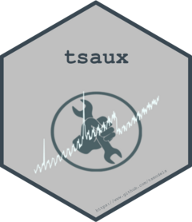

```{r, echo = FALSE}
version <- as.vector(read.dcf('DESCRIPTION')[, 'Version'])
version <- gsub('-', '.', version)
```

# tsaux 
[](https://github.com/tsmodels/tsaux/actions)
[)`-yellowgreen.svg)](/commits/master)
[](commits/master)
[](https://cran.r-project.org/package=tsaux)


```{r, echo = FALSE}
knitr::opts_chunk$set(
  collapse = TRUE,
  comment = "#>",
  fig.path = "README-"
)
```

# tsaux

Time series auxiliary functions used in the **tsmodels** packages, 
grouped into the following 6 areas (see vignette for more details):


| Group            | Description                                                        |
|-----------------|--------------------------------------------------------------------|
| **Anomalies**    | Anomaly detection                                                |
| **Calendar/Time** | Inference and conversion utilities for time/dates               |
| **Metrics**      | Performance metrics for point and distributional forecasts       |
| **Simulation**   | Simulation by parts including Trend, Seasonal, ARMA, Irregular and Anomalies |
| **Transformations** | Data transformations including Box-Cox, Logit, Softplus-Logit, and Sigmoid |
| **Miscellaneous** | Miscellaneous functions                                         |
